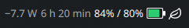
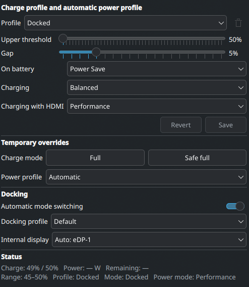

# Battery Charge Limits for Plasma 6

A Plasma 6 panel widget for controlling the generic Linux battery charge
thresholds while showing live battery and power-profile information.





## Features

- Saved profiles with upper threshold and restart gap
- Save/Revert editing before a profile is applied
- Current charge versus configured limit in the panel
- Charge/discharge power and estimated remaining time
- Blue charge-limit layer, green current-charge layer, and charging bolt
- Full and Safe full temporary charging actions
- Automatic KDE power profiles for battery, AC, and HDMI operation
- Per-charge-profile Power Save, Balanced, and Performance rules
- Temporary manual power-profile override
- Optional automatic switching between Normal and Docked mode

## Requirements

- KDE Plasma 6
- Linux battery driver exposing both
  `charge_control_start_threshold` and `charge_control_end_threshold` under
  `/sys/class/power_supply`
- `kpackagetool6`, `pkexec`, PolicyKit, `sudo`, and `busctl`
- A service implementing `org.freedesktop.UPower.PowerProfiles` for automatic
  Power Save/Balanced/Performance switching

The widget remains useful as a status display when charge thresholds or power
profiles are unavailable, but the corresponding controls cannot work without
those interfaces.

## Install from Git

Clone the repository and run the installer as your regular desktop user:

```sh
git clone https://github.com/GregorBoxer-sudo/ThinkCharge.git
cd ThinkCharge
./install.sh
```

The script asks for `sudo` once to install the narrowly scoped threshold helper
and a PolicyKit rule. It then installs the widget only for the current user.
Open Plasma's widget browser, search for **Battery Charge Limits**, and add it to
the panel. If an older loaded instance does not refresh, log out and back in.

Do not run the entire installer with `sudo`; doing so would install the Plasma
package for the wrong user.

## Install a release archive

Download and extract the release source archive, then run `./install.sh` from
the extracted directory. The standalone `.plasmoid` asset contains only the
unprivileged widget and is intended for upgrades or systems where the helper was
already installed:

```sh
kpackagetool6 --type Plasma/Applet --install \
  org.kde.plasma.batterythresholds-2.8.12.plasmoid
```

The same limitation applies when installing from KDE's **Get New Widgets**
dialog or store.kde.org: Plasma can install the widget, but it cannot install
the root-owned helper or its PolicyKit rule. The widget shows a setup warning
until you download the source package and run `./install.sh` as your regular
desktop user. Status and power-profile features remain available without the
helper; changing charge thresholds does not.

## Upgrade

Pull or extract the new source and run the same installer again:

```sh
git pull
./install.sh
```

The installer also enables `battery-charge-limits.service`. It stores the last
normal charge limits in `/etc/battery-charge-limits.conf` and restores them at
boot before the display manager starts. Temporary Full and Safe full actions
are deliberately not persisted.

The script detects an existing package and uses Plasma's upgrade operation.

## Uninstall

Run from a source checkout:

```sh
./uninstall.sh
```

This removes the Plasma package, privileged helper, and PolicyKit rule. Plasma's
saved widget configuration is intentionally retained.

## How it works

The status reader takes an unprivileged snapshot every ten seconds. It reads
battery thresholds, capacity, charging state, energy/power data, display
connections, and the active system power profile. Charging time is estimated to
the configured upper limit; discharging time is estimated to empty and therefore
changes with current system load.

Profile edits are staged until Save is selected. Revert restores the last saved
values. Automatic power-profile selection runs only on a relevant state change,
so a manual selection made elsewhere in Plasma is not overwritten every ten
seconds. The explicit override remains active until Automatic is selected.

The **Automatic mode switching** toggle enables or disables automatic selection
of the Docked profile. When enabled, AC power plus an active external display
selects Docked mode after a short debounce; disconnecting either returns to the
saved Normal profile. The toggle does not force Docked mode by itself.

## Security

Only `battery-threshold-helper` runs with elevated privileges. It accepts a
battery basename and two integers, reconstructs the sysfs paths itself, verifies
the device and range, and reads the written values back. It accepts no arbitrary
file path or command. The generated PolicyKit rule authorizes only the active
local user who ran `install.sh` and only this fixed helper path.

## Development and releases

Run the local checks:

```sh
./scripts/check.sh
```

Besides syntax and QML validation, this runs behavior tests against a simulated
sysfs tree and verifies rejection of unsafe helper inputs.

Build the versioned `.plasmoid` and SHA-256 checksum in `dist/`:

```sh
./scripts/build-release.sh
```

See [CHANGELOG.md](CHANGELOG.md) for release history and [RELEASE.md](RELEASE.md)
for the maintainer checklist.

## License

GPL-3.0-or-later. See [LICENSE](LICENSE).
